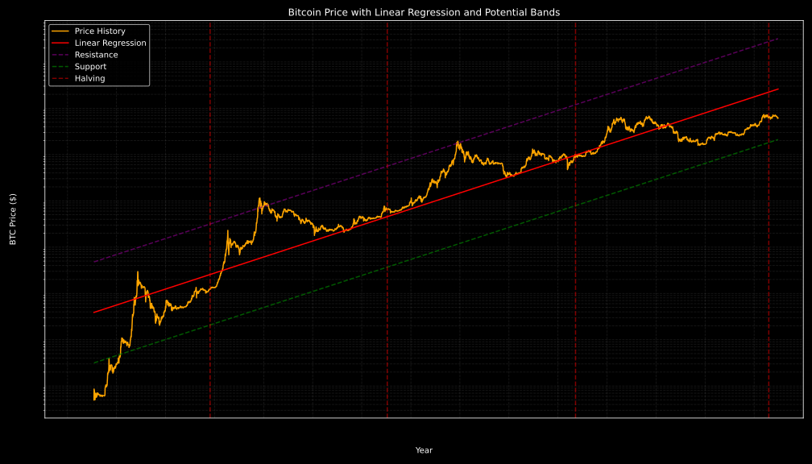
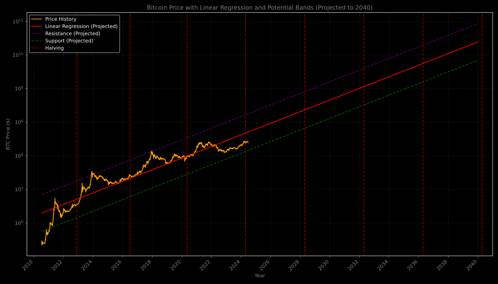

# Bitcoin Power Law Chart
AI Gen: 

The Bitcoin power law chart is a long-term price model that suggests Bitcoin's price follows a power law function over time. This model, unlike traditional linear or exponential growth models used in stock markets, posits that Bitcoin's price scales in a predictable, non-random way over the long run, indicating a structured mathematical pattern based on time rather than purely speculative movements.   

The chart is typically constructed by plotting Bitcoin's historical price data on a log-log scale, where both the time and price axes use logarithms. This scaling helps to reveal long-term growth trends while smoothing out short-term volatility. A power function of the form $\(P(t) = a \cdot t^b\)$ is then applied to this data, where $\(P(t)\)$ represents Bitcoin's price at time $\(t\)$, and $\(a\)$ and $\(b\)$ are constants determined by historical data. The variable $\(t\)$ usually represents the time since Bitcoin's inception, often measured in days or years. The model also includes upper and lower bounds, creating price bands that illustrate the historical range within which Bitcoin's price has fluctuated relative to the long-term trend. These bands can be used to identify potential overbought or oversold conditions.

The Bitcoin power law model offers a simple and visual way to assess Bitcoin's long-term price trend, suggesting that its growth follows a consistent pattern throughout history. By focusing on multi-year trends, it aims to help investors make more rational decisions, avoiding emotional reactions to short-term market fluctuations. When plotted on a logarithmic chart, the power law curve provides an intuitive visual guide to determine if Bitcoin is relatively overvalued or undervalued.

However, it's crucial to acknowledge the risks and shortcomings of this model. It assumes that past trends will continue, which may not hold true if future adoption slows or if unexpected challenges arise. The model also does not account for market and economic events, such as regulations, macroeconomic shifts, or major technological changes, that could significantly impact Bitcoin's price. As it is based entirely on historical price patterns, there's a risk of overfitting, and the model may not adapt if Bitcoin's growth trajectory changes. Additionally, Bitcoin's price can deviate from the predicted range, making it an unreliable sole tool for forecasting. Unlike other models like Stock-to-Flow, the power law model does not factor in Bitcoin's supply schedule, such as halvings. Investors should, therefore, exercise caution and use the power law chart in conjunction with other analysis methods and a comprehensive understanding of market dynamics.

## First Chart 

## Second Chart 

## Third Chart 

## Buy me a Coffee: 
BTC: bc1q2kqvggm552h0csyr0awa2zepdapxdqnacw0z5w

